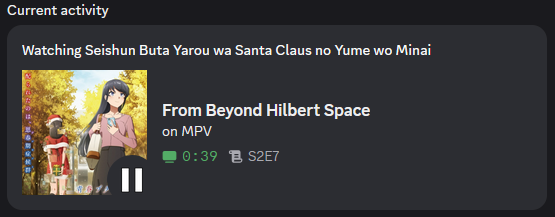
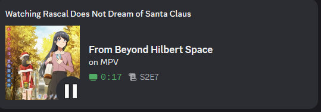
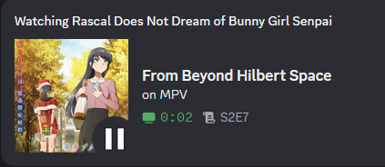
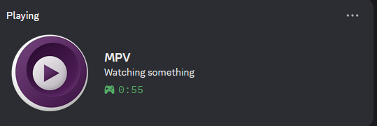

# MPV Discord RPC

Discord Rich Presence for MPV Media Player with automatic anime metadata support.

<p align="center">
  
  
  
  
  
</p>

<p align="center">
  
  <br>
  <em>RPC in action</em>
</p>

<p align="center">
  <a href="README.md">English</a> | <a href="README_PT.md">Português</a>
</p>

---

## Table of Contents

- [Overview](#overview)
- [Features](#features)
- [Requirements](#requirements)
- [Quick Start](#quick-start)
- [Installation](#installation)
- [Configuration](#configuration)
- [MPV Setup](#mpv-setup)
- [MyAnimeList Sync](#myanimelist-sync)
- [Stremio MPV Bridge](#stremio-mpv-bridge)
- [Screenshots](#screenshots)
- [Releases](#releases)
- [Contributing](#contributing)

---

## Overview

**MPV Discord RPC** is a tool that integrates your MPV Media Player with Discord, displaying what you're watching in real-time. The main highlight is automatic anime detection from filenames, fetching detailed metadata (covers, official titles) using the MyAnimeList API.

---

## Features

**Core Features**
- Automatic anime detection from filenames
- Metadata fetching via Jikan API (MyAnimeList)
- Anime cover display in Discord Rich Presence
- Local caching to avoid repeated API requests
- Privacy mode to hide media details

**Integration Features**
- **MyAnimeList Sync:** Automatically update your watch progress
- **Stremio MPV Bridge:** Open Stremio Web streams directly in MPV
  - Smart auto-playlist support
  - Player compatibility for Anime (Kitsu)

> **Note:** Cover display currently works only for anime. Configure this in your `.env` file.

---

## Requirements

- Node.js 22 or higher
- MPV Media Player
- Discord Desktop

### Optional: Python (for local GuessIt CLI)

Python is **no longer required** if you use the cloud-based GuessIt API! The parser now supports three modes:

1. **☁️ Cloud API** (recommended) - No Python needed, works on all platforms
2. **💻 Local CLI** - Requires `pip install guessit` (Python 3.12+)
3. **🔤 Regex Fallback** - Always available, basic parsing only

> **New users:** Use the cloud API by setting `GUESSIT_API_URL` in your `.env` file. See [GuessIt API Setup](#guessit-api-setup) below.

> **Existing users:** Your local `guessit` installation still works as a fallback.

---

## Quick Start

### Option 1: Cloud API (No Python Required) ⭐ Recommended

```bash
# Clone and install Node dependencies only
git clone https://github.com/gabszap/mpv-rpc.git && cd mpv-rpc
npm install

# Configure environment
cp .env.example .env
# Edit .env and set: GUESSIT_API_URL=https://your-api.vercel.app/api/parse

# Add IPC server to MPV configuration
echo 'input-ipc-server=\\.\pipe\mpv' >> "%APPDATA%/mpv/mpv.conf"  # Windows
echo 'input-ipc-server=/tmp/mpv-socket' >> ~/.config/mpv/mpv.conf  # Linux

# Build and run
npm run dev
```

### Option 2: Local GuessIt (Python Required)

```bash
# Clone and install dependencies (including Python guessit)
git clone https://github.com/gabszap/mpv-rpc.git && cd mpv-rpc
pip install guessit && npm install

# Configure environment
cp .env.example .env

# Add IPC server to MPV configuration
echo 'input-ipc-server=\\.\pipe\mpv' >> "%APPDATA%/mpv/mpv.conf"  # Windows
echo 'input-ipc-server=/tmp/mpv-socket' >> ~/.config/mpv/mpv.conf  # Linux

# Build and run
npm run dev
```

---

## Installation

### 1. Clone the Repository

```bash
git clone https://github.com/gabszap/mpv-rpc.git
cd mpv-rpc
```

### 2. Install Node Dependencies

```bash
npm install
```

### 3. (Optional) Install GuessIt Locally

Only needed if you want to use local CLI instead of cloud API:

```bash
pip install guessit
```

### 4. Build the Project

```bash
npm run build
```

---

## GuessIt API Setup

**No Python? No problem!** You can now use a cloud-based GuessIt API instead of installing Python locally.

### Using the Pre-built API

You have two options for using the cloud API:

#### Option A: Use Our Public API (Quickest) 🚀

Use our already-deployed API - no setup required!

1. **Simply add to your `.env` file**:
   ```env
   USE_GUESSIT_API=true
   GUESSIT_API_URL=https://guessit-api.vercel.app/api/parse
   ```

2. **Done!** Start mpv-rpc and it will use our cloud API.

> **Privacy Notice:** 
> - The API code is open source and doesn't collect or store any user data
> - The API only receives filenames and returns parsed metadata - nothing is saved by our code
> - We have no reason to collect your data, and we don't want to
> 
> This is a free public API hosted on Vercel. While we strive to keep it running, for maximum privacy or heavy usage you may want to deploy your own (Option B).

#### Option B: Deploy Your Own API (Recommended for Privacy)

The project includes a ready-to-deploy Vercel API in the `guessit-api/` folder:

1. **Deploy the API** (one-time setup):
   ```bash
   cd guessit-api
   npm i -g vercel  # Install Vercel CLI if you haven't
   vercel
   # Follow the prompts to deploy
   ```

2. **Copy the deployed URL** (e.g., `https://your-project.vercel.app/api/parse`)

3. **Configure mpv-rpc** to use it:
   ```bash
   cd ..
   cp .env.example .env
   # Edit .env and add:
   # USE_GUESSIT_API=true
   # GUESSIT_API_URL=https://your-project.vercel.app/api/parse
   ```

### Parser Priority

The parser automatically tries these methods in order:

1. **Cloud API** - If `GUESSIT_API_URL` is set
2. **Local CLI** - If `guessit` is installed locally
3. **Regex Fallback** - Basic pattern matching (always works)

### Benefits of Cloud API

- ✅ No Python installation required
- ✅ Works identically on Windows, Linux, and macOS
- ✅ Always uses latest guessit version
- ✅ Intelligent caching (no repeated calls for same filename)
- ✅ Zero local dependencies except Node.js

---

## Configuration

Copy the example environment file and adjust settings:

```bash
cp .env.example .env
```

Environment values are loaded automatically via `dotenv` from `.env` at startup.

### Available Options

| Option | Description | Default |
|--------|-------------|---------|
| `SHOW_COVER` | Display anime cover image | `true` |
| `PRIVACY_MODE` | Hide all media details | `false` |
| `HIDE_IDLING` | Hide status when MPV is idle | `false` |
| `SHOW_TITLE` | Use anime title as activity name | `true` |
| `TITLE_LANG` | Preferred title language (`english`, `romaji`, `none`) | `none` |
| `METADATA_PROVIDER` | Metadata source (`jikan`, `anilist`, `kitsu`, `tvdb`) | `jikan` |
| `TVDB_API_KEY` | TheTVDB API key (required when using `tvdb`, optional for fallbacks) | (empty) |
| `TVDB_LANG` | Preferred TheTVDB language code for episode metadata | `eng` |
| `USE_GUESSIT_API` | Use cloud API for filename parsing | `true` |
| `GUESSIT_API_URL` | URL of your GuessIt API endpoint | (empty) |
| `MAL_SYNC` | Enable MyAnimeList synchronization | `false` |
| `MAL_CLIENT_ID` | MyAnimeList API Client ID | (empty) |
| `MAL_SYNC_THRESHOLD` | Percentage watched to trigger sync (0-100) | `90` |
| `DISCORD_RPC` | Enable Discord Rich Presence | `true` |

---

## MPV Setup

MPV must be started with the IPC server enabled.

### Option 1: Configuration File

Add to your `mpv.conf`:

```ini
# Windows
input-ipc-server=\\.\pipe\mpv

# Linux
input-ipc-server=/tmp/mpv-socket
```

### Option 2: Command Line

```bash
# Windows
mpv --input-ipc-server=\\.\pipe\mpv <file>

# Linux
mpv --input-ipc-server=/tmp/mpv-socket <file>
```

---

## Usage

Start the application:

```bash
npm start
```

Or build and run in one command:

```bash
npm run dev
```

> **Note:** After making changes to the code, run `npm run build` or `npm run dev` to rebuild.

**The application will:**
1. Connect to Discord
2. Monitor for MPV instances (with auto-reconnection)
3. Update your Discord status in real-time
4. Sync progress to MyAnimeList (if enabled and authenticated)

---

## MyAnimeList Sync

Automatically sync your watch progress to MyAnimeList. Requires one-time authentication.

For detailed setup instructions, see the [MAL Sync Setup Guide](docs/mal-sync-setup.md).

---

## Stremio MPV Bridge

Integrate Stremio Web with MPV to open streams directly in the player with smart playlist support.

**Features:**
- Full playback support for Kitsu content
- Enhanced series title and episode identification from Stremio

For setup instructions, see the [Stremio MPV Bridge Guide](docs/stremio-mpv-bridge.md).

---

## How It Works

1. **IPC Connection:** Connects to MPV via named pipe/Unix socket to get real-time playback data (title, position, duration, pause state)

2. **Filename Parsing:** Intelligently extracts series title, season, and episode from filenames using:
   - ☁️ **Cloud API** (optional, no Python required)
   - 💻 **Local GuessIt CLI** (if installed)
   - 🔤 **Regex Fallback** (always available)

3. **Metadata Fetching:** If anime is detected, queries the Jikan API for cover images, translated titles, and episode data

4. **Rich Presence:** Formats and sends data to Discord with progress bars and state icons

> **Smart Caching:** The parser caches results to avoid repeated API calls for the same filename, improving performance and reducing server load.

---

## Screenshots

### Title Language Options

| Romaji | English | Filename |
|:------:|:-------:|:--------:|
|  |  |  |

### Configuration Options

| showCover | showTitleAsPresence |
|:---------:|:-------------------:|
|  |  |

### Privacy Mode



---

## Recommended Scripts

Enhance your MPV experience with these useful scripts from [Eisa01/mpv-scripts](https://github.com/Eisa01/mpv-scripts):

| Script | Description |
|--------|-------------|
| [SmartSkip](https://github.com/Eisa01/mpv-scripts#smartskip) | Automatically skip intros, outros, and silence |
| [SmartCopyPaste](https://github.com/Eisa01/mpv-scripts#smartcopypaste) | Copy/paste video paths, URLs, and timestamps |

---

## Dependencies

- [@xhayper/discord-rpc](https://www.npmjs.com/package/@xhayper/discord-rpc) - Discord RPC Client
- [axios](https://www.npmjs.com/package/axios) - HTTP Client
- [dotenv](https://www.npmjs.com/package/dotenv) - `.env` loader
- [guessit](https://pypi.org/project/guessit/) - Filename parser
- [Jikan](https://jikan.moe/) - Unofficial MyAnimeList API
- [AniList](https://anilist.co/) - AniList API
- [Kitsu](https://kitsu.io/) - Kitsu API
- [PreMiD](https://premid.app/) - Assets reference

---

## Releases

Project releases are automated with **semantic-release** on pushes to `main`.

- Versioning and release notes are generated from **Conventional Commits**.
- `CHANGELOG.md` is generated/updated automatically by the release workflow.
- Do not run `npm version` manually for project releases.
- For local `semantic-release` runs, use **Node.js >= 20.8.1** (the workflow uses Node 22).

---

## Contributing

Contributions are welcome. Feel free to open issues and pull requests.

1. Fork the project
2. Create your feature branch (`git checkout -b feature/AmazingFeature`)
3. Commit your changes (`git commit -m 'Add some AmazingFeature'`)
4. Push to the branch (`git push origin feature/AmazingFeature`)
5. Open a Pull Request

---

## TODO

**Completed:**
- [x] Linux support (Unix sockets)
- [x] Configuration via `.env` file
- [x] AniList API support
- [x] Kitsu API support
- [x] MAL sync (mark as watched)
- [x] Guessit Cloud API - No Python required!

**Planned:**
- [ ] Metadata for movies and TV series (TMDb/OMDb)
- [ ] System tray (run in background)
- [ ] Graphical interface (GUI) for configuration
- [ ] Mini Mode (show only filename without metadata fetch)

---

## License

MIT License - see the project files for details.
